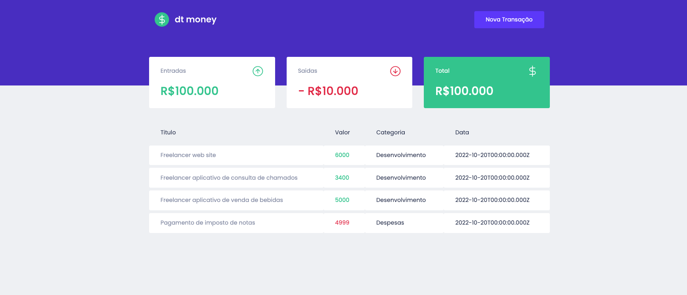

# Sistema de Controle Financeiro
## O projeto tem como proposito criar um projeto de controle financeiro simples 

<h1 align="center">
  
</h1>

<h1 align="center">
  
</h1>

### Features
- [ ] Exibição de Entrada
- [ ] Exibição de Saida
- [ ] Exibição de Total de Transação
- [ ] Listagem de Histórico de Transação
- [ ] Cadastro de Nova Transação
 

### Pré-requisitos

Antes de começar, você vai precisar ter instalado em sua máquina as seguintes ferramentas:
[Git](https://git-scm.com), [Node.js](https://nodejs.org/en/). 
Além disto é bom ter um editor para trabalhar com o código como [VSCode](https://code.visualstudio.com/)

### 🎲 Rodando o Projeto (frontend)

```bash
# Clone este repositório
$ git clone <https://github.com/gblnovaes/dtmoney>

# Acesse a pasta do projeto no terminal/cmd
$ cd dtmoney

# Instale as dependências
$ yarn 

# Execute a aplicação em modo de desenvolvimento
$ yarn start

# O serviço inciará na porta:3000 - acesse <http://localhost:3000>

```